# Manual de Usuario

Este documento está diseñado para guiar al usuario en el uso del programa **PGV-Data-Analyzer**. Proporciona instrucciones detalladas sobre cómo configurar, ejecutar y utilizar las funcionalidades del programa, incluyendo la entrada y salida de datos, así como la interpretación de los resultados generados. Además, se incluyen ejemplos prácticos y explicaciones sobre los comandos y archivos necesarios para el correcto funcionamiento del sistema.

## Índice

1. [Primera vez ejecutando el programa](#1-primera-vez-ejecutando-el-programa)
   - [¿Por qué utilizamos `javac -d bin src/**/*.java`?](#¿por-qué-utilizamos-javac--d-bin-srcjava)
2. [Entrada de datos (CSV y Consola)](#2-entrada-de-datos-csv-y-consola)
   - [Fichero products.csv](#fichero-productscsv)
   - [Fichero sales.csv](#fichero-salescsv)
   - [Entrada por consola](#entrada-por-consola)
   - [Prueba de depuración](#prueba-de-depuración)
3. [Salida de datos (CSV y Consola)](#3-salida-de-datos-csv-y-consola)
   - [Fichero de productos con STOCK ALTO](#fichero-de-productos-con-stock-alto)
   - [Fichero de productos con STOCK BAJO](#fichero-de-productos-con-stock-bajo)
   - [Fichero de ventas por DÍA](#fichero-de-ventas-realizadas-por-día)
   - [Fichero de ventas por PRODUCTO](#fichero-de-ventas-realizadas-por-producto)
   - [Salida por consola](#salida-por-consola)
4. [Interpretación de datos](#4-interpretación-de-datos)

<br>

## 1. Primera vez ejecutando el programa

Al ejecutar el programa por primera vez, asegúrate de tener instalado Java en tu sistema.

Como ya fue anteriormente mencionado en el [README.md](../README.md), una vez hemos hecho `git clone` del repositorio, debemos situarnos en el directorio raíz del proyecto, que es [PGV-Data-Analyzer](../../PGV-Data-Analyzer/) y ejecutamos el siguiente comando para compilar el proyecto:

```bash
javac -d bin src/**/*.java
```

### ¿Por qué utilizamos `javac -d bin src/**/*.java`?

1. **`javac`**: Es el compilador de Java que traduce los archivos `.java` (código fuente) en archivos `.class` (bytecode) que pueden ser ejecutados por la JVM (Java Virtual Machine).

2. **`-d bin`**: La opción `-d` especifica el directorio de destino donde se guardarán los archivos `.class` generados. En este caso, los archivos compilados se almacenarán en el directorio `bin`. Esto ayuda a mantener el proyecto organizado, separando el código fuente (`src`) de los archivos compilados (`bin`).

3. **`src/**/\*.java`**: Este patrón indica que se deben compilar todos los archivos `.java`dentro del directorio`src`y sus subdirectorios. El uso de`\*\*` asegura que se incluyan archivos en cualquier nivel de subdirectorios, lo cual es útil para proyectos con estructuras de paquetes complejas.

Esto asegura el correcto funcionamiento del programa, ya que sin compilar previamente el código, no será posible ejecutarlo. Además, el programa está diseñado para trabajar con una estructura de directorios que incluye una carpeta `bin` destinada a los archivos compilados.

Una vez correctamente compilado, podemos ejecutar el programa de dos maneras:

<table>
    <thead>
        <tr>
            <th><strong>Por Consola</strong></th>
            <th><strong>Por la IDE (VS Code)</strong></th>
        </tr>
    </thead>
    <tbody>
        <tr>
            <td>Ejecuta el programa con el comando: <code>java -cp bin App</code> desde la carpeta raíz.</td>
            <td>
                <p>Ejecuta el programa directamente desde la interfaz de Visual Studio Code.</p>
                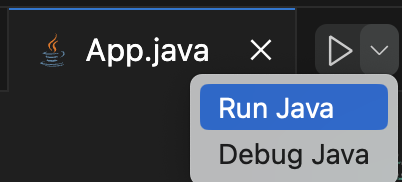
            </td>
        </tr>
    </tbody>
</table>

Si todo sale correctamente, deberías de ver lo siguiente por consola:

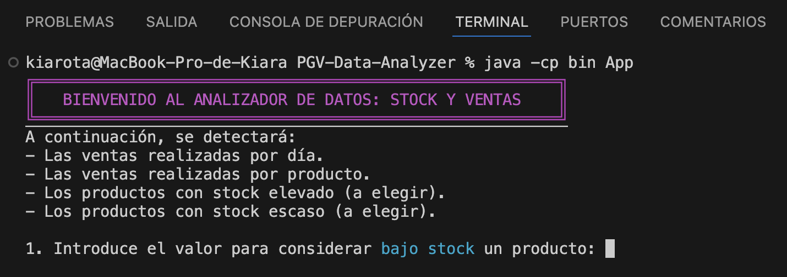

<br>

## 2. Entrada de datos (CSV y Consola)

El programa permite dos formas de entrada de datos:

1. **Archivo CSV**: Los archivos CSV son aquellos con los datos a analizar. Estos se encuentran en el directorio [/src/data/input](/src/data/input/), bajo los nombres [products.csv](/src/data/input/products.csv) para los productos y [sales.csv](/src/data/input/sales.csv) para las ventas de los mismos.
2. **Consola**: Introducción de datos manualmente siguiendo el formato especificado en las instrucciones del programa. Específicamente se utiliza la entrada de datos por consola para la elección de los argumentos que serán pasados al módulo [StockAnalyzer](/src/net/salesianos/modules/StockAnalyzer.java): cuánta cantidad de stock consideraremos poca o excesiva.

### Fichero products.csv

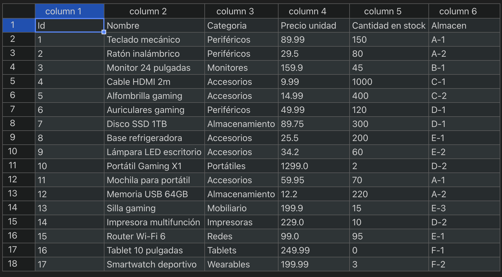
_**Para visualizar de esta manera el contenido de los ficheros .csv en VS Code, instala la extensión: [Edit CSV](https://marketplace.visualstudio.com/items?itemName=janisdd.vscode-edit-csv)**_

Como se observa en la imagen anterior, el archivo `products.csv` contiene una tabla con los siguientes campos:

- **Id**: Identificador único del producto.
- **Nombre**: Nombre del producto.
- **Categoría**: Tipo o clasificación del producto.
- **Precio Unidad**: Precio por unidad del producto.
- **Cantidad en stock**: Número de unidades disponibles en el inventario.
- **Almacén**: Ubicación o almacén donde se encuentra el producto.

Estos campos son esenciales para el análisis, ya que permiten identificar y categorizar los productos, así como evaluar su disponibilidad y ubicación.

### Fichero sales.csv

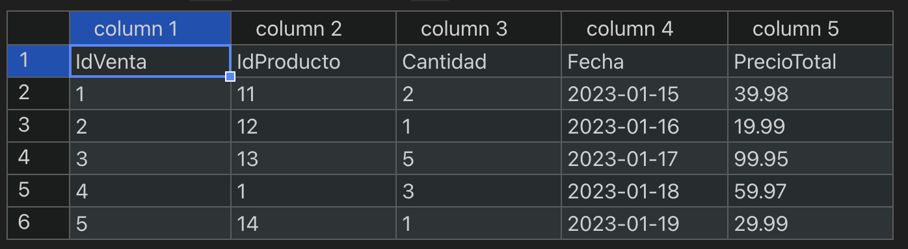

En cuanto el archivo `sales.csv`, este contiene una tabla con los siguientes campos:

- **IdVenta**: Identificador único de la venta.
- **IdProducto**: Identificador único del producto.
- **Cantidad**: Número de unidades vendidas.
- **Fecha**: Día, mes y año en que se efectuó la venta.
- **Precio Total**: Monto total facturado.

`⚠️ ¡Atención! El usuario es libre de modificar los valores en los registros (productos o ventas) en estos ficheros, pero no se recomienda la modificación del orden, nombre y tipo de dato de los campos que conforman la tabla, pues estos son utilizados para los cálculos realizados en el programa.`

### Entrada por consola

Desde la consola, una vez ejecutado, el programa nos solicitará dos valores enteros:


En primer lugar, nos pide que indiquemos CUÁNTAS unidades debe de tener un producto para ser considerado producto con un **stock bajo**. Esto lo vemos en la imagen superior.

Después, nos pedirá CUÁNTAS unidades debe de tener un producto para ser considerado producto con un **stock alto**.

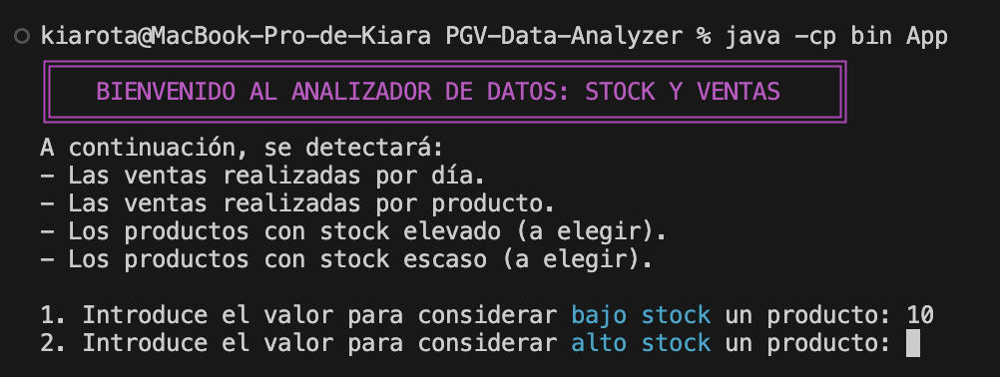

### Prueba de depuración

El programa puede generar diferentes respuestas en la consola dependiendo de la entrada proporcionada por el usuario. A continuación, se muestra una tabla con las posibles respuestas y su significado:

<table>
    <thead>
        <tr>
            <th><strong>Respuesta</strong></th>
            <th><strong>Descripción</strong></th>
        </tr>
    </thead>
    <tbody>
        <tr>
            <td>
                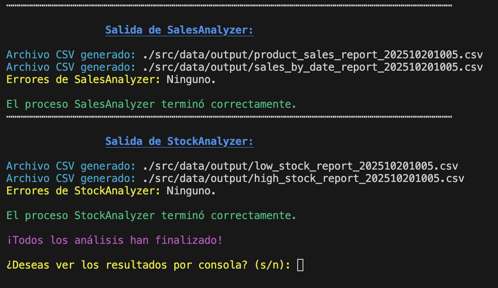
            </td>
            <td>El programa se ejecutó correctamente sin errores. Los datos de entrada fueron válidos y el análisis se completó con éxito.</td>
        </tr>
        <tr>
            <td>
                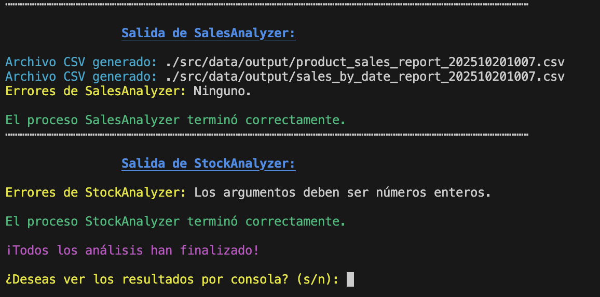
            </td>
            <td>Se produjo un error durante la ejecución. Esto puede deberse a datos de entrada incorrectos, como en este caso.</td>
        </tr>
    </tbody>
</table>

Los archivos `.csv` correspondientes ya han sido generados correctamente en los subprocesos que no presentaron errores. Ahora, el programa ofrece la posibilidad de visualizar su contenido directamente en la consola. Para ello, el usuario debe elegir entre las siguientes opciones:

- **`s`**: Mostrar el contenido de los archivos `.csv` en la consola.
- **`n`**: Omitir la visualización en la consola y continuar con la ejecución del programa.

<br>

## 3. Salida de datos (CSV y Consola)

Los resultados del análisis pueden exportarse o visualizarse de las siguientes maneras:

1. **Archivo CSV**: Automáticamente guarda los resultados en un archivo CSV indicando la fecha, para su posterior uso.
2. **Consola**: Opcionalmente, visualiza los resultados directamente en la terminal.

### Fichero de productos con stock ALTO

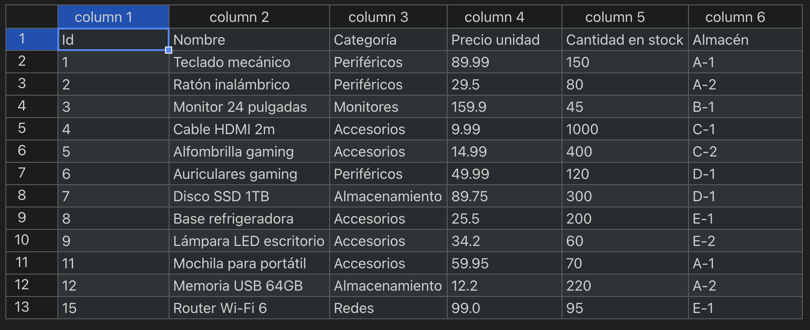

Misma estructura que el fichero de [productos](#fichero-productscsv), pero únicamente incluyendo aquellos que cumplan el requisito: tener tantas o MENOS unidades en stock que las indicadas por el usuario.

### Fichero de productos con stock BAJO

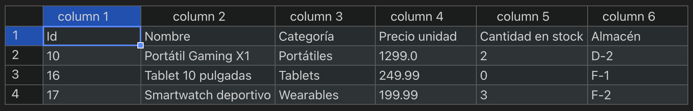

Misma estructura que el fichero de [productos](#fichero-productscsv), pero únicamente incluyendo aquellos que cumplan el requisito: tener tantas o MENOS unidades en stock que las indicadas por el usuario.

### Fichero de ventas realizadas por DÍA

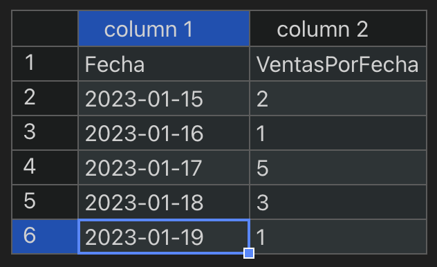

El archivo generado de **ventas realizadas por DÍA** contiene un resumen de las ventas agrupadas por fecha. Este archivo incluye las siguientes columnas:

- **Fecha**: Día, mes y año en que se realizaron las ventas.
- **Ventas por Fecha**: Número total de ventas realizadas en esa fecha.

Este reporte permite analizar el comportamiento de las ventas a lo largo del tiempo, identificando patrones o días con mayor actividad comercial.

### Fichero de ventas realizadas por PRODUCTO

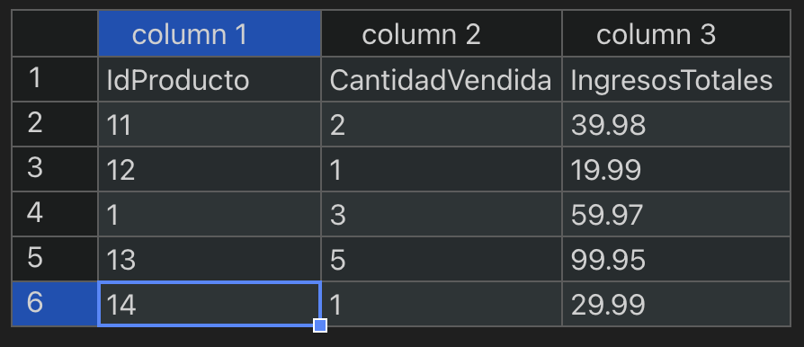

El archivo generado de **ventas realizadas por PRODUCTO** contiene un resumen de las ventas agrupadas por cada producto. Este archivo incluye las siguientes columnas:

- **IdProducto**: Identificador único del producto.
- **CantidadVendida**: Número total de unidades vendidas de ese producto.
- **IngresosTotales**: Suma total de los ingresos generados por las ventas de ese producto.

Este reporte permite analizar el rendimiento de cada producto, identificando cuáles son los más vendidos y cuáles generan mayores ingresos, lo que puede ser útil para la toma de decisiones comerciales.

### Salida por consola

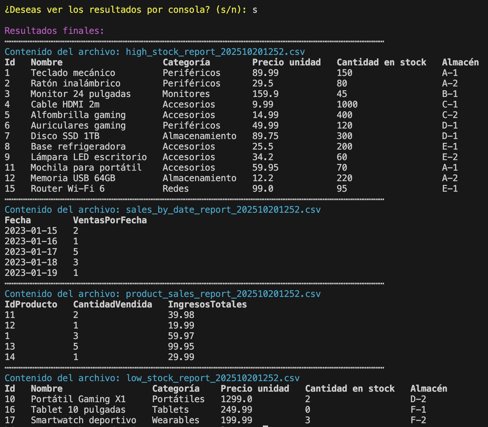

Como muestra la captura de pantalla de la consola, podemos decidir ver los .csv pintados en la consola, ofreciendo una visualización más fácil de interpretar en comparación a la de VS Code sin extensiones.

<br>

## 4. Interpretación de datos

El programa **PGV-Data-Analyzer** genera múltiples reportes que permiten interpretar los datos de manera eficiente. A continuación, se describen los principales aspectos a considerar:

1. **Productos con stock alto y bajo**:

   - Los archivos generados para productos con **stock alto** y **stock bajo** permiten identificar rápidamente los productos que requieren reabastecimiento o aquellos que tienen un exceso de inventario. Esto facilita la optimización de la gestión de inventarios.

2. **Ventas por día**:

   - El reporte de ventas agrupadas por día ayuda a identificar patrones de comportamiento en las ventas, como días con mayor o menor actividad comercial. Esto puede ser útil para planificar promociones o ajustar estrategias de marketing.

3. **Ventas por producto**:

   - El análisis de ventas por producto permite determinar cuáles son los productos más vendidos y cuáles generan mayores ingresos. Esta información es clave para tomar decisiones sobre la oferta de productos, promociones y estrategias de ventas.

4. **Visualización en consola**:
   - La opción de visualizar los resultados directamente en la consola proporciona una manera rápida y accesible de interpretar los datos sin necesidad de abrir los archivos generados.

En conjunto, estos reportes ofrecen una visión integral del desempeño de los productos y las ventas, permitiendo tomar decisiones informadas para mejorar la eficiencia operativa y maximizar los ingresos.
